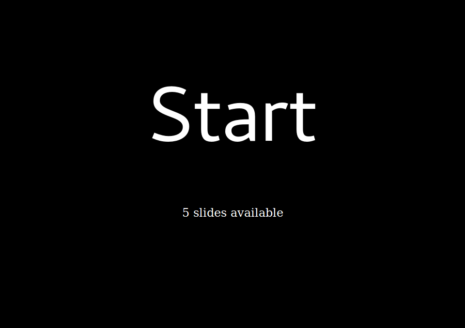
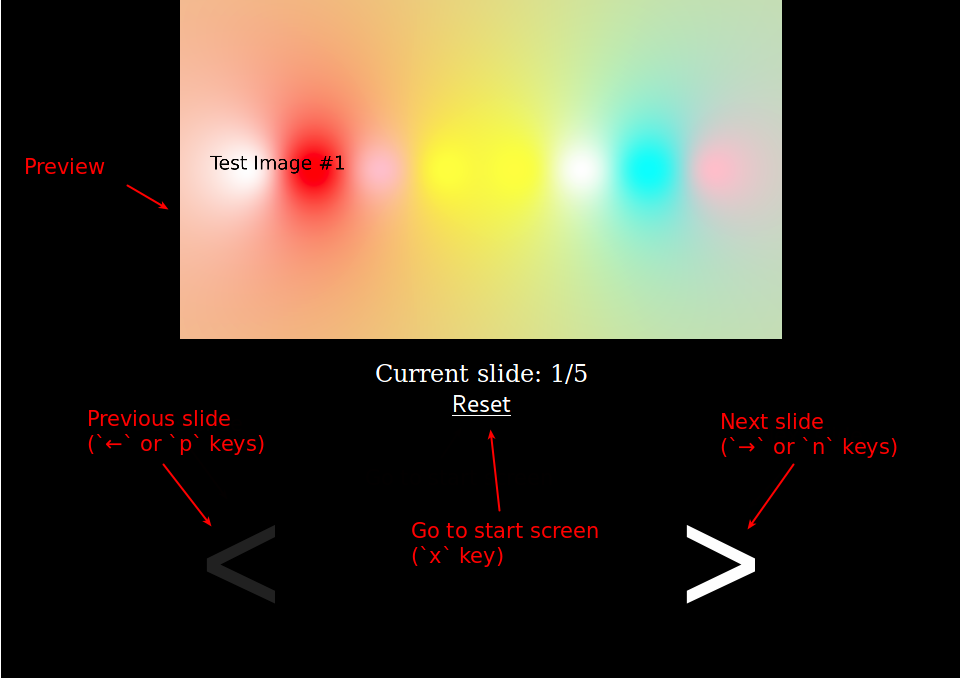

# Impressioner

## Bootstraping ("how to run this piece of... software")
Obviously you need to download this repo somehow.

Then you need to have docker somehow installed.

### Building image

To build image you have to, well, build it:
```shell
docker build . -t impressioner'
```

### Running app

This awkward command starts application on 4000 port:
```shell
docker run -ti --env PORT=4000 -v $(pwd)/priv/static/slides:/app/priv/static/slides -p 4000:4000 --rm impressioner
```
Where `4000` is port and `/app/priv/static/slides` is directory with your slides (images).

If you need some "security" (even if it's not secure at all because of unsecured WS channels) you can set up **slides** (`/`) and **control panel** (`/panel`) basic auth with env variables `SLIDES_USERNAME`, `SLIDES_PASSWORD`, `PANEL_USERNAME`, `PANEL_PASSWORD` like this:
```shell
docker run -ti --env PORT=4000 --env PANEL_USERNAME=user --env PANEL_PASSWORD=pass -v $(pwd)/priv/static/slides:/app/priv/static/slides -p 4000:4000 --rm impressioner
```

To stop application hit `C-c` twice.

## Using the app

### Slides
You can use any images as slides. They will be arranged in filename order.

Application will read all files in directory mounted as `/app/priv/static/slides` inside docker container.

### URLs
There are two parts in impressioner: *slides* and *control panel*.

*Slides* is available at `/`, while *control panel* is available at `/panel`.

### *Slides*
This page is supposed to be used by wathers, TVs, screens, etc. It contains just image at the centre of viewport. Hit fullscreen button for more immersive experience!

### *Control panel*
Well, a panel, to controll ~em all~ slides.

This is start screen:


To start presentation either click "start" text or press Enter.

Here is how *control panel* looks after clicking "start":

Screenshot is pretty self-explanatory, so use it as the rest of "Usage" page.
